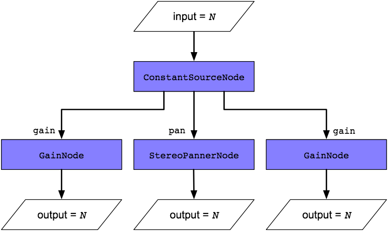

# Synthesizer

[GitHub Repository](https://github.com/abonello/mySynthesizer)  
[Deployment](https://abonello.github.io/mySynthesizer/)  

## Technologies
* HTML
* CSS
* javaScripts
* jQuery
* WebAudio API
* SVG

## Short Description

I will use SVG elements to display a piano keyboard. This keyboard can trigger sounds. It will also display the note pressed on SVG generated Treble clef stave.

I will also link the computer keyboard to the synthesizer to be enable it to be played from there.

Later I might add octave buttons that will transpose both the displayed keyboard and the triggered notes from the computer keyboard up and down in octave intervals.

Another addirion that I would like to implement is some control on attack time and overall envelope and harmonic content of the notes. The simplest might be adding odd and even harmonics, controlling an overall volume for the set and perhaps a generic envelope such as falling off volumes as frequency of harmonics increase.

## SVG Treble Clef
Found two svg treble clefs on [wikimedia](https://commons.wikimedia.org/wiki/File:G-clef.svg). They are public domain. I will use one of them. To decide later.

## SVG Semibreve

~~Found at [wikimedia](https://commons.wikimedia.org/wiki/File:1-1_note_semibreve.svg). License -  Creative Commons Attribution-Share Alike 3.0 Unported license.~~  
Changed the semibreve to one with no white space around it. (Based on previous semibreve.) I am using this one.

====================

## Adding title

I tried to add a title to the page and some info. I noticed that because I placed the controls for wave shapes and the slider as fixed position now they lost their place. I need to change this.

I created a new slider in svg.

## Example 1 - Controlling multiple parameters with ConstantSourceNode

Following tutorial from this [LINK](https://developer.mozilla.org/en-US/docs/Web/API/Web_Audio_API/Controlling_multiple_parameters_with_ConstantSourceNode).

This article demonstrates how to use a ConstantSourceNode to link multiple parameters together so they share the same value, which can be changed by simply setting the value of the ConstantSourceNode.offset parameter.  

You may have times when you want to have multiple audio parameters be linked so they share the same value even while being changed in some way. For example, perhaps you have a set of oscillators, and two of them need to share the same, configurable volume, or you have a filter that's been applied to certain inputs but not to all of them. You could use a loop and change the value of each affected AudioParam one at a time, but there are two drawbacks to doing it that way: first, that's extra code that, as you're about to see, you don't have to write; and second, that loop uses valuable CPU time on your thread (likely the main thread), and there's a way to offload all that work to the audio rendering thread, which is optimized for this kind of work and may run at a more appropriate priority level than your code.  

The solution is simple, and it involves using an audio node type which, at first glance, doesn't look all that useful: ConstantSourceNode.  

### The technique
This is actually a really easy way to do something that sounds like it might be hard to do. You simply need to create a ConstantSourceNode and connect it to all of the AudioParams whose values should be linked to always match each other. Since ConstantSourceNode's offset value is simply sent straight through to all of its outputs, it acts as a splitter for that value, sending it to each connected parameter.  

The diagram below shows how this works; an input value, N, is set as the value of the ConstantSourceNode.offset property. The ConstantSourceNode can have as many outputs as necessary; in this case, we've connected it to three nodes: two GainNodes and a StereoPannerNode. So N becomes the value of the specified parameter (gain for the GainNodes and pan for the StereoPannerNode.  

As a result, every time you change N (the value of the input AudioParam, the values of the two GainNodes' gain properties and the value of the StereoPannerNode's pan propertry are all set to N as well.

### Example

Let's take a look at this technique in action. In this simple example, we create three OscillatorNodes. Two of them have adjustable gain, controlled using a shared input control. The other oscillator has a fixed volume.

### HTML

The HTML content for this example is primarily a button to toggle the oscillator tones on and off and an <input> element of type range to control the volume of two of the three oscillators.

### JavaScript

Now let's take a look at the JavaScript code, a piece at a time.

#### Setting Up

Let's start by looking at the global variable initialization.

Now let's look at the setup() function, which is our handler for the window's load event; it handles all the initialization tasks that require the DOM to be in place.

First, we get access to the window's AudioContext, stashing the reference in context. Then we get references to the control widgets, setting playButton to reference the play button and volumeControl to reference the slider control that the user will use to adjust the gain on the linked pair of oscillators.

Then we assign a handler for the play button's click event (see Toggling the oscillators on and off for more on the togglePlay() method), and for the volume slider's input event (see Controlling the linked oscillators to see the very short changeVolume() method).

Next, the GainNode gainNode1 is created to handle the volume for the non-linked oscillator (oscNode1). We set that gain to 0.5. We also create gainNode2 and gainNode3, setting their values to match gainNode1, then set the value of the volume slider to the same value, so it is synchronized with the gain level it controls.

Once all the gain nodes are created, we create the ConstantSourceNode, constantNode. We connect its output to the gain AudioParam on both gainNode2 and gainNode3, and we start the constant node running by calling its start() method; now it's sending the value 0.5 to the two gain nodes' values, and any change to constantNode.offset will automatically set the gain of both gainNode2 and gainNode3 (affecting their audio inputs as expected).

Finally, we connect all the gain nodes to the AudioContext's destination, so that any sound delivered to the gain nodes will reach the output, whether that output be speakers, headphones, a recording stream, or any other destination type.

After setting the window's load event handler to be the setup() function, the stage is set. Let's see how the action plays out.

### Toggling the oscillators on and off

Because OscillatorNode doesn't support the notion of being in a paused state, we have to simulate it by terminating the oscillators and starting them again when the play button is clicked again to toggle them back on. Let's look at the code.

If the playing variable indicates we're already playing the oscillators, we change the playButton's content to be the Unicode character "right-pointing triangle" (▶️) and call stopOscillators() to shut down the oscillators. See Stopping the oscillators below for that code.

If playing is false, indicating that we're currently paused, we change the play button's content to be the Unicode character "pause symbol" (⏸) and call startOscillators() to start the oscillators playing their tones. That code is covered under Starting the oscillators below.

### Controlling the linked oscillators
The changeVolume() function—the event handler for the slider control for the gain on the linked oscillator pair—looks like this:

That simple function controls the gain on both nodes. All we have to do is set the value of the ConstantSourceNode's offset parameter. That value becomes the node's constant output value, which is fed into all of its outputs, which are, as set above, gainNode2 and gainNode3.

While this is an extremely simple example, imagine having a 32 oscillator synthesizer with multiple linked parameters in play across a number of patched nodes. Being able to shorten the number of operations to adjust them all will prove invaluable for code size and performance both.

### Starting the oscillators
When the user clicks the play/pause toggle button while the oscillators aren't playing, the startOscillators() function gets called.

Each of the three oscillators is set up the same way:

1. Create the OscillatorNode by calling AudioContext.createOscillator().
2. Set the oscillator's type to "sine" to use a sine wave as the audio waveform.
3. Set the oscillator's frequency to the desired value; in this case, oscNode1 is set to a middle C, while oscNode2 and oscNode3 round out the chord by playing the E and G notes.
4. Connect the new oscillator to the corresponding gain node.  

Once all three oscillators have been created, they're started by calling each one's ConstantSourceNode.start() method in turn, and playing is set to true to track that the tones are playing.

### Stopping the oscillators
Stopping the oscillators when the user toggles the play state to pause the tones is as simple as stopping each node.  

Each node is stopped by calling its ConstantSourceNode.stop() method, then playing is set to false.

